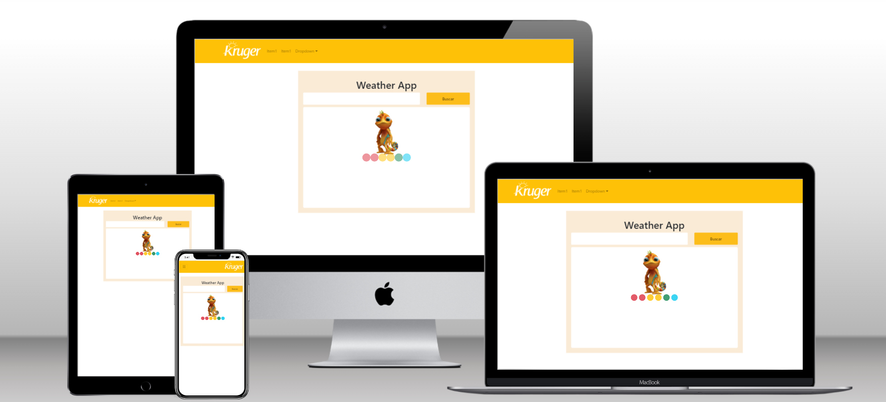

# Kruger Star Using the Effect Hook - React.js

> Project Using the Effect Hook - React.js

## Built with 

- JavaScript
- React.js 18
- React Bootstrap
- Netlify 
- HTML + CSS

## Live Demo

 -  [Live demo link, deployed in Vercel](https://use-effect-example-vrvi.vercel.app/)
## Run it locally

 ### Setup

 - Clone this repo using `git clone https://github.com/Piguave/UseEffectExample.git`

 ### Commands

 - `npm i`
 - `npm start`

## Author

👤 **Ariel Piguave**

- GitHub: 
- Twitter: 

## 🤝 Contributing

- Juan Sotomayor - Tutor Kruger Star
- [Vida MRR](https://www.youtube.com/watch?v=oT-feDPuJmk&t=5623s&ab_channel=VidaMRR-Programacionweb)

## Show your support

Give a ⭐ if you like this project!

## Acknowledgments

- Design by: JS

## 📝 License

This project is [MIT](./MIT.md) licensed.
